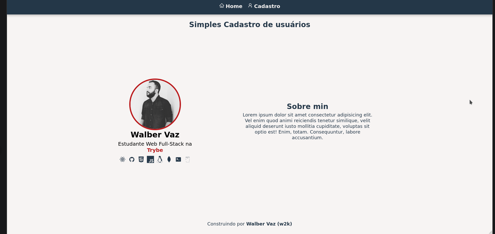
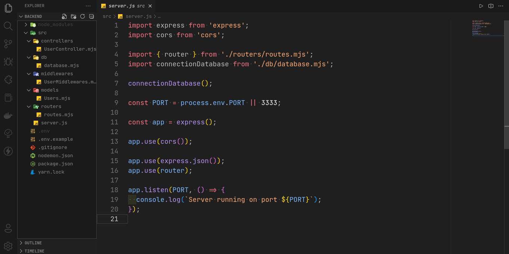

# Estudo React(Frontend) e Backend(Nodejs)

🚨 __Projeto em Contrução__ 🚨

Projeto de estudo de integração backend com frontend

## Autores

- 👤 [@walber-vaz](https://www.github.com/walber-vaz)
- 👤 [Linkedin](https://www.linkedin.com/in/walber-vaz/)

## Demonstração
__Frontend__
💅 

__Backend__
💀 

## Funcionalidades

Frontend
- React 18
- vite
- react-router-dom
- styled-components

Backend
- Nodejs 18.x
- express
- cors
- mondodb atlas

## 🚀 Sobre mim
Eu sou uma pessoa estudante web full-stack... na [Trybe](https://www.betrybe.com/)

## Licença

[MIT](https://choosealicense.com/licenses/mit/)

